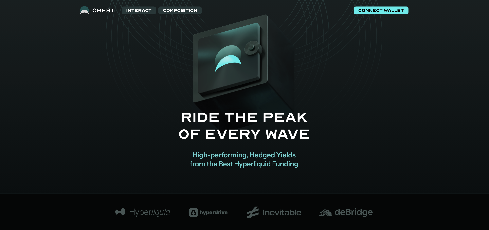

> Crest — Ride the reak of every wave. High-performing, Hedged Yields from the Best Hyperliquid Funding

Crest operates as a sophisticated yield-generating vault using the EIP-2535 Diamond proxy pattern for modularity.

Built specifically for the Hyperliquid ecosystem, Crest creates a symbiotic relationship between lending markets, perpetual futures, and spot trading to maximize capital efficiency and generate superior risk-adjusted returns.

### (i) Core Architecture & Flow

Users deposit USDT0 and receive Crest shares representing their vault position. When funding rates deviate from fair value, the vault takes offsetting positions between spot and perps, helping normalize funding and improving price discovery

### (ii) Crest actively improves perpetual market efficiency through:

- **Funding Rate Arbitrage**: When funding rates deviate from fair value, the vault takes offsetting positions between spot and perps, helping normalize funding and improving price discovery
- **Liquidity Provision**: Our systematic rebalancing provides consistent two-sided liquidity, tightening bid-ask spreads
- **Price Anchoring**: By maintaining hedged positions across spot and perps, we help keep perpetual prices aligned with underlying spot markets

### (iii) The Diamond architecture separates concerns across specialized facets:

- **VaultFacet**: Core position management, Hyperdrive integration, and cross-facet authorization
- **TellerFacet**: User deposits/withdrawals with anti-arbitrage share locks
- **ManagerFacet**: Hyperliquid spot/perp position allocation and rebalancing logic
- **AccountantFacet**: Real-time NAV calculation incorporating all positions (Hyperdrive shares, spot holdings, perp P&L, CoreWriter premiums)

### (iv) Ecosystem Value Creation

How Crest aligns with the Hyperliquid/HyperEVM ecosystem:

- **For Lenders**: Consistent USDT0 supply to Hyperdrive increases lending pool depth and stability
  - Incoming (not-yet-allocated) USDT0 is automatically deployed to Hyperdrive money markets, supplying crucial lending liquidity to the Hyperliquid ecosystem.This creates a positive feedback loop; more lending supply enables more leverage trading, which increases borrowing demand and lending yields.
- **For Traders**: Improved funding rates and tighter spreads reduce trading costs
  - Crest can be seen as a decentralized market maker which actively improves perpetual market efficiency through:
    - (i) Liquidity Enhancement: Our systematic rebalancing provides consistent two-sided liquidity, tightening bid-ask spreads
    - (ii) Price Alignment: By maintaining hedged positions across spot and perps, we help keep perpetual prices aligned with underlying spot markets
- **For the Protocol**: Increased TVL, volume, and fee generation across all integrated protocols
- **For Crest Users**: Multiple uncorrelated yield streams (lending APY + option premiums + funding capture) with professional risk management

### (v) etc

- The exchange rate continuously updates based on: `(Hyperdrive shares value + spot holdings + perp P&L + accumulated premiums - fees) / outstanding vault shares`, ensuring users receive fair value reflecting all yield sources and market movements.

- Crest transforms passive USDT0 holdings into an active, yield-generating position that simultaneously strengthens Hyperliquid's market infrastructure while delivering superior returns to vault participants.

- How we aligns with the Hyperliquid/HyperEVM ecosystem:
  1. Incoming (not-yet-allocated) USDT0 is automatically deployed to Hyperdrive money markets, supplying crucial lending liquidity to the Hyperliquid ecosystem.This creates a positive feedback loop - more lending supply enables more leverage trading, which increases borrowing demand and lending yields.

  2. Crest can be seen as a decentralized market maker which actively improves perpetual market efficiency through:

     i. Liquidity Enhancement: Our systematic rebalancing provides consistent two-sided liquidity, tightening bid-ask spreads

     ii. Price Alignment: By maintaining hedged positions across spot and perps, we help keep perpetual prices aligned with underlying spot markets
